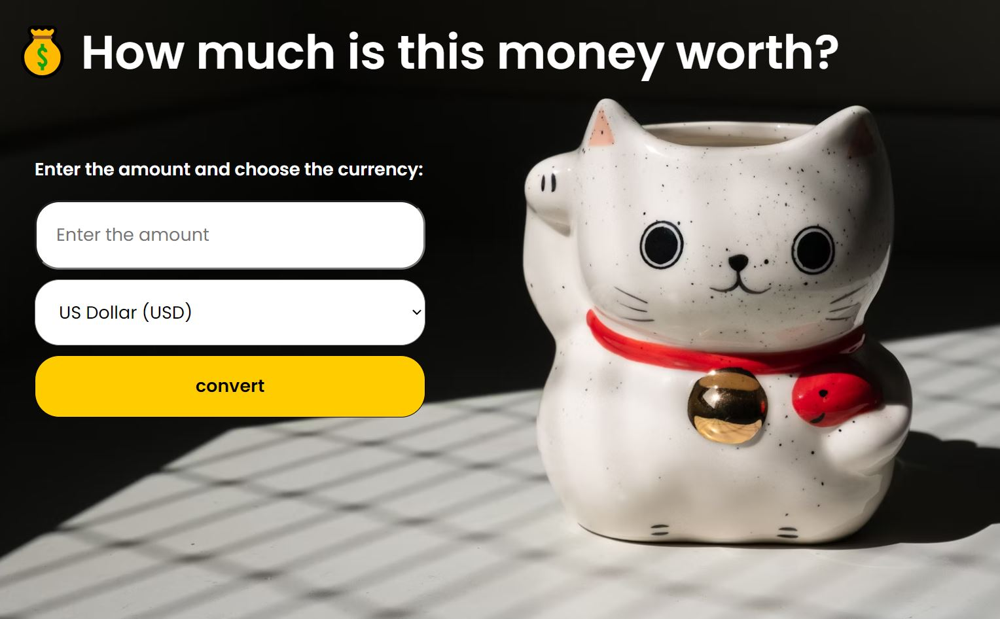

# Currency Converter 🌍💰
A simple currency converter built with HTML, CSS, and JavaScript.  
It fetches real-time exchange rates from an API and allows users to convert between multiple currencies.

## Features  
- Converts between multiple currencies  
- Uses real-time exchange rates  
- Simple and user-friendly interface  

## How to Use  
1. Enter the amount to convert  
2. Select the source currency  
3. Click "Convert" to see the results  
